<h1 align="center">Magic Box</h1>

<p align="center">～ Quick In Quick Out ～</p>

<p align="center">
  <a href="#">
    
  </a>
  <a href="#">
    
  </a>
</p>

---

## Usage 🏁

Magic Box parses user input into two parts: `input` and `options`.

For example, when Magic Box receives the following user input:
The input will be `https://youtu.be/dQw4w9WgXcQ` and the option key is `shorten` with the value `document`.

```
https://youtu.be/dQw4w9WgXcQ
::shorten=document
```

Based on matching methods, we can roughly classify Boxes into two types:

1. match by the `input` string
2. match by `options`

### Keyboard Shortcuts ⌨️

- Ctrl + n: move to the next Box
- Ctrl + Shift + n: move to the previous Box
- Ctrl + p: move to the previous Box
- Enter: copy the selected Box output to clipboard
- Cmd/Ctrl + Enter: copy the selected Box output and paste it into the input field (recalculates results)

<details>
<summary> <b>Base64Box</b> </summary>

| match rule                    | description   | output                     |
| ----------------------------- | ------------- | -------------------------- |
| valid string                  | base64 encode | 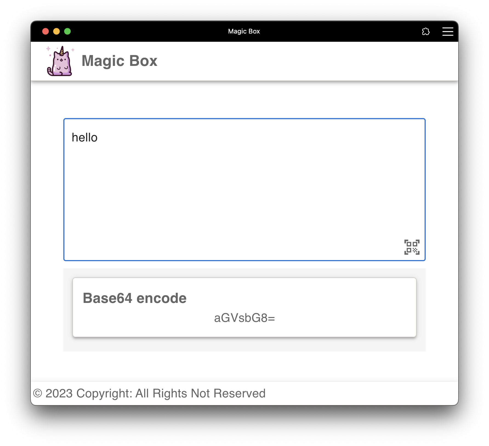 |
| can be decode to valid string | base64 decode | 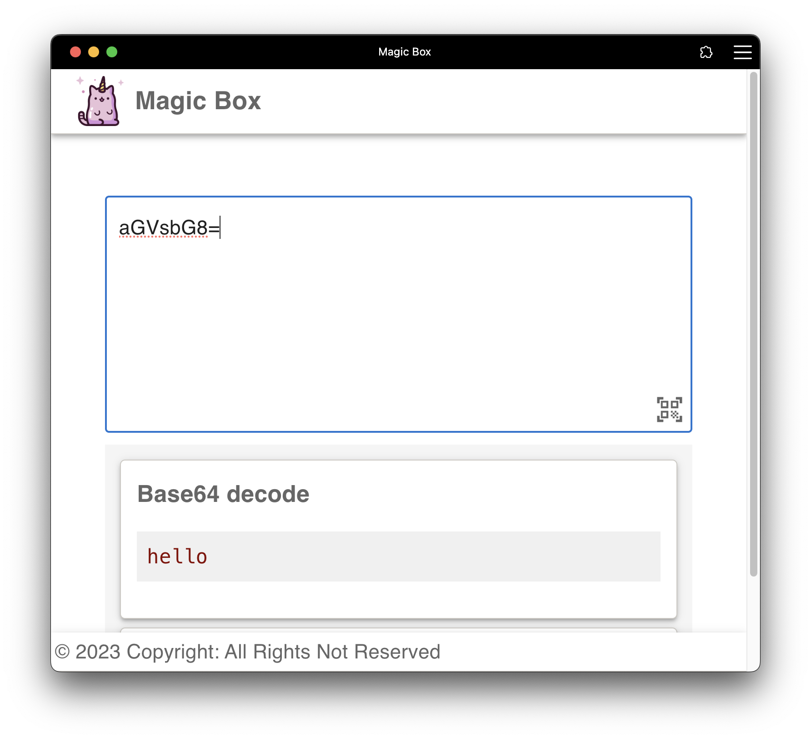 |

</details>

<details>
<summary> <b>CronExpressionBox</b> </summary>

| match rule            | description               | output                    |
| --------------------- | ------------------------- | ------------------------- |
| valid cron expression | convert to human language | 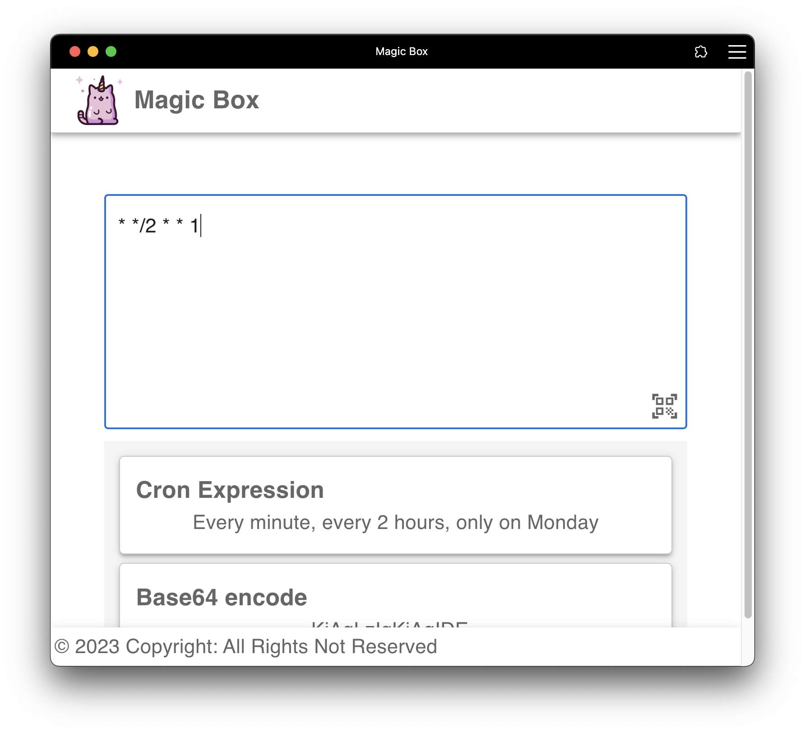 |

| options                          | description                             | example     |
| -------------------------------- | --------------------------------------- | ----------- |
| `l`, `lang`, `locate`            | select while human language             | ::locale=tw |
| ~~`tz`, `timezone`, `tzOffset`~~ | (deprecated) shift to the base timezone | ::tz=8      |

</details>

<details>
<summary> <b>GenerateQRCodeBox</b> </summary>

| match rule                       | description      | output                       |
| -------------------------------- | ---------------- | ---------------------------- |
| contains option `qr` or `qrcode` | generate QR Code | 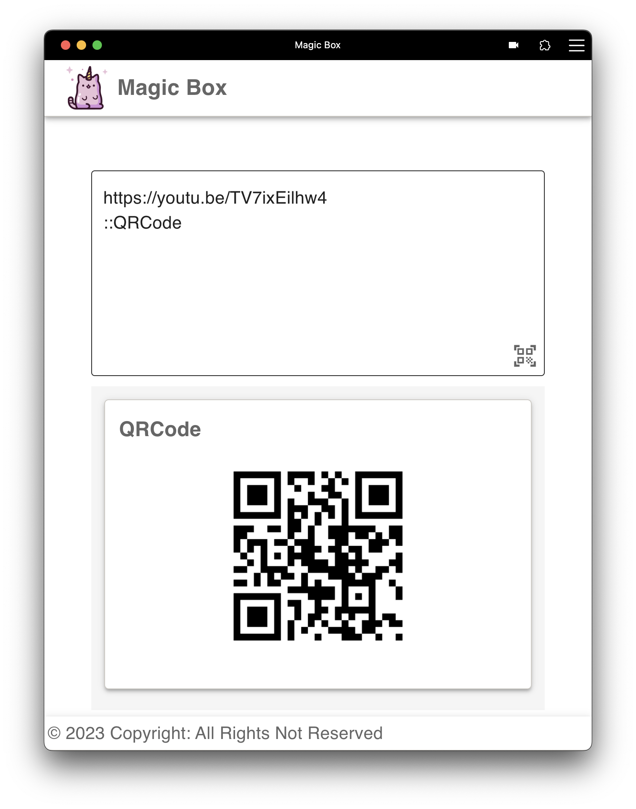 |

| options        | description | example    |
| -------------- | ----------- | ---------- |
| `qr`, `qrcode` | --          | `::QRCode` |

</details>

<details>
<summary> <b>JWTBox</b> </summary>

| match rule       | description                | output                  |
| ---------------- | -------------------------- | ----------------------- |
| valid JWT string | decode JWT header and body | 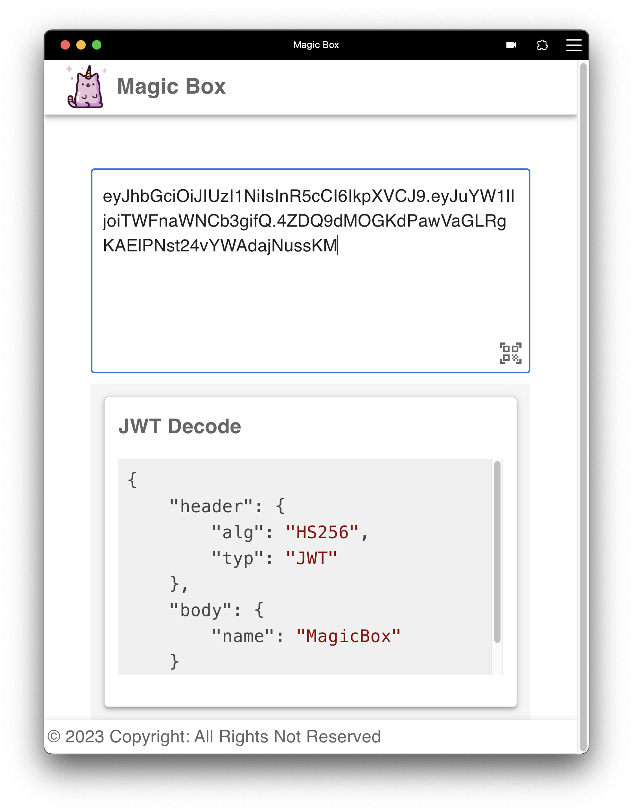 |

</details>

<details>
<summary> <b>MathExpressionBox</b> </summary>

| match rule         | description               | output                       |
| ------------------ | ------------------------- | ---------------------------- |
| valid math express | calculate the math result | 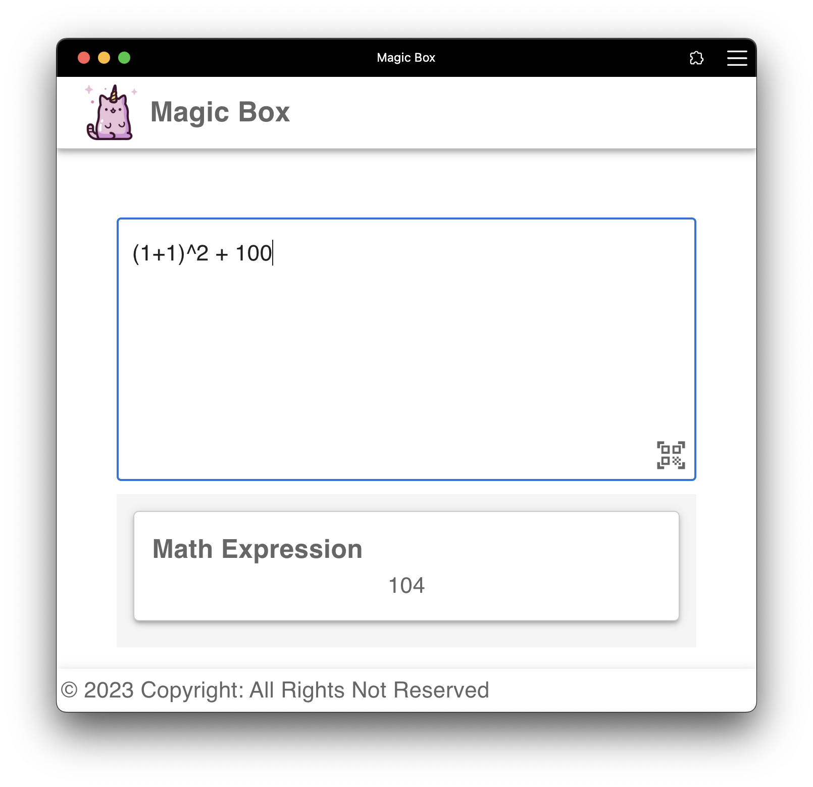 |

</details>

<details>
<summary> <b>NowBox</b> </summary>

| match rule          | description                                                                                    | output            |
| ------------------- | ---------------------------------------------------------------------------------------------- | ----------------- |
| input matches `now` | show current time in 3 difference formats: `RFC 3339`, `RFC 3339 (UTC+8)`, and `Timestamp (s)` | 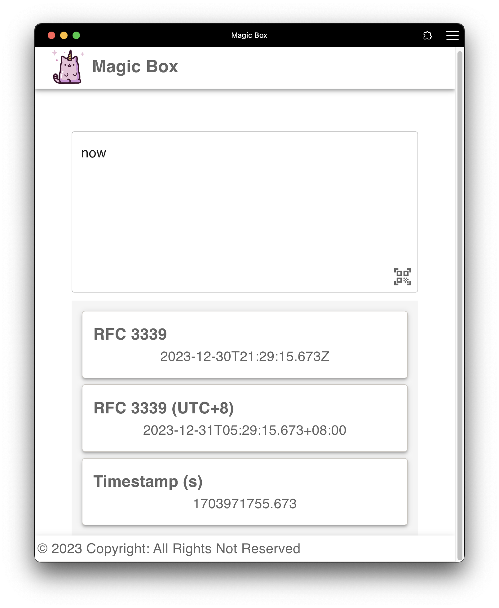 |

</details>

<details>
<summary> <b>PrettyJSON</b> </summary>

| match rule | description    | output                   |
| ---------- | -------------- | ------------------------ |
| valid JSON | formatted JSON | 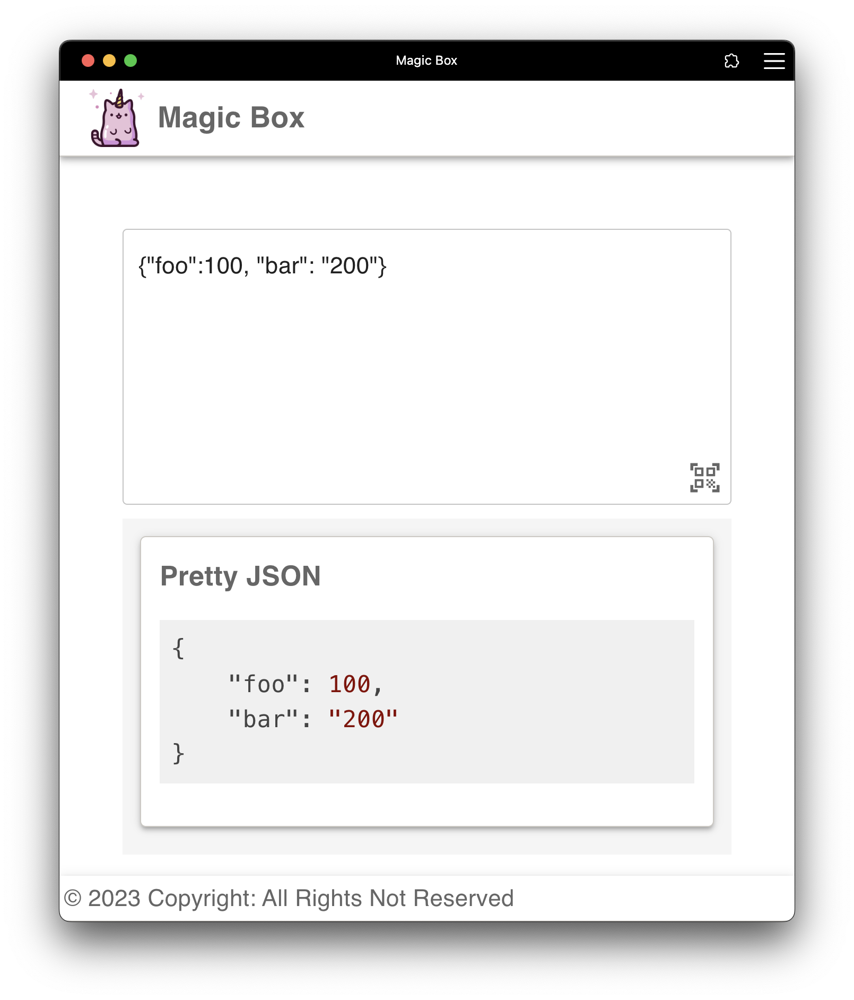 |

</details>

<details>
<summary> <b>ShortenURLBox</b> </summary>

| match rule                          | description            | output                   |
| ----------------------------------- | ---------------------- | ------------------------ |
| contains option `surl` or `shorten` | generate a shorten URL | 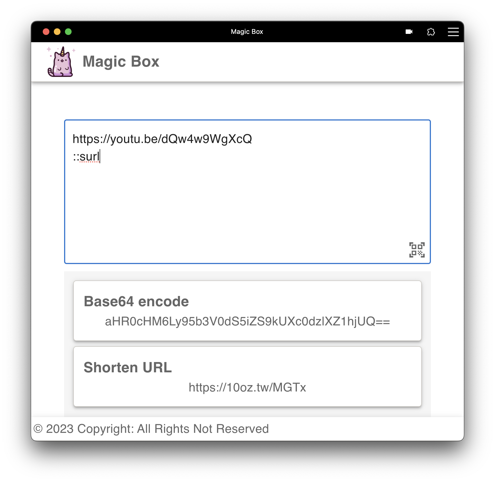 |

| options           | description                                                        | example      |
| ----------------- | ------------------------------------------------------------------ | ------------ |
| `surl`, `shorten` | desired short URL result, if not set, a random string will be used | `::surl=foo` |

</details>

<details>
<summary> <b>TimeFormat</b> </summary>

| match rule                 | description                         | output                   |
| -------------------------- | ----------------------------------- | ------------------------ |
| valid RFC 3339 time string | timestamp in second and millisecond | 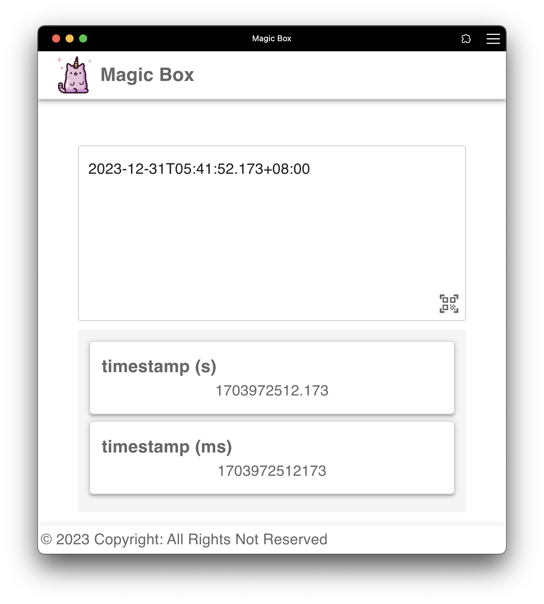 |

</details>

<details>
<summary> <b>TimestampBox</b> </summary>

| match rule                                                                               | description                                | output                   |
| ---------------------------------------------------------------------------------------- | ------------------------------------------ | ------------------------ |
| valid timestamp. to avoid match all of number string, it only receive 1600 AD to 2500 AD | the time of timestamp in `RFC 3339` format |  |

</details>

<details>
<summary> <b>URLDecode</b> </summary>

| match rule         | description                | output                          |
| ------------------ | -------------------------- | ------------------------------- |
| URL-encoded string | decoded URL-encoded string | 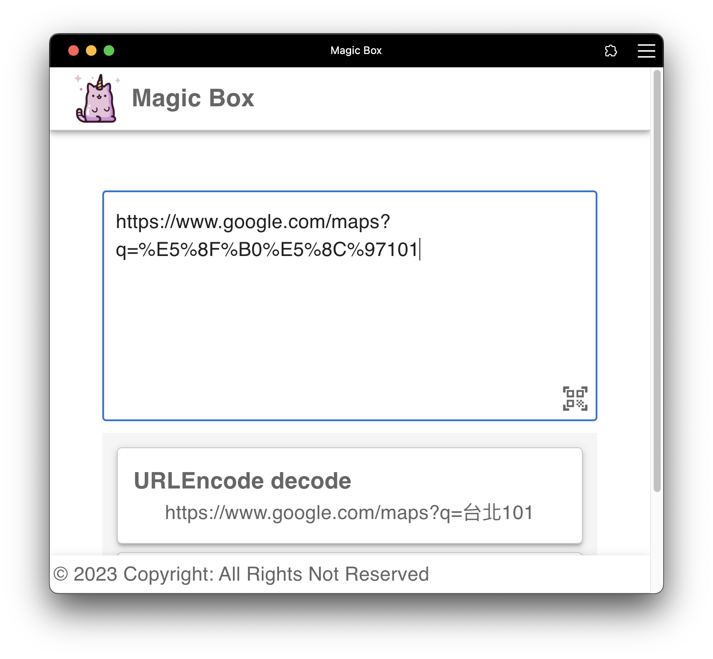 |

</details>

## Development ⛑️

It is recommended to use Node.js version 22.x

```bash
pnpm build:wasm
pnpm install
pnpm start
```

### Development Commands

- `pnpm build:wasm` - Build WASM modules before development/deployment (required for base64-box dependency)
- `pnpm start` - Start development server on port 3000
- `pnpm build` - Build for production (runs TypeScript compiler + Vite build)
- `pnpm test` - Run unit tests with Vitest
- `pnpm test:ui` - Run tests with Vitest UI
- `pnpm lint` - Run ESLint on src/ and config files
- `pnpm lint:fix` - Run ESLint with auto-fix
- `pnpm test:e2e` - Run Cypress E2E tests
- `pnpm cypress` - Open Cypress test runner

### Testing

- Unit tests use Vitest with jsdom environment
- E2E tests use Cypress with custom commands in `cypress/support/`

### Prepare Deploy

Initial Deployment Preparation

```bash
npm install -g firebase-tools

firebase login
firebase init
```

```bash
firebase deploy
```

## License 📃

Magic Box is licensed under MIT and Apache 2.0 dual-licensed.

You may obtain a copy of the License at [LICENSE-MIT](LICENSE-MIT) and [LICENSE-APACHE](LICENSE-APACHE)
