<h1 align="center">Magic Box</h1>

<p align="center">～ Quick In Quick Out ～</p>

<p align="center">
  <a href="#">
    
  </a>
  <a href="#">
    
  </a>
</p>

---

## Usage 🏁

Magic Box parses user input into two parts: `input` and `options`.

For example, when Magic Box receives the following user input:
The input will be `https://youtu.be/dQw4w9WgXcQ` and the option key is `shorten` with the value `document`.

```
https://youtu.be/dQw4w9WgXcQ
::shorten=document
```

Based on matching methods, we can roughly classify Boxes into two types:

1. match by the `input` string
2. match by `options`

### Keyboard Shortcuts ⌨️

- Ctrl + n: move to the next Box
- Ctrl + Shift + n: move to the previous Box
- Ctrl + p: move to the previous Box
- Enter: copy the selected Box output to clipboard
- Cmd/Ctrl + Enter: copy the selected Box output and paste it into the input field (recalculates results)

<details>
<summary> <b>ColorBox</b> </summary>

| match rule                          | description                                        | example                  |
| ----------------------------------- | -------------------------------------------------- | ------------------------ |
| hex color (`#RGB`, `#RRGGBB`, `#RRGGBBAA`) | convert to HEX, RGB, and HSL              | `#ff6347`                |
| `rgb()` / `rgba()`                  | convert to HEX, RGB, and HSL (alpha preserved)     | `rgb(255, 99, 71)`       |
| `hsl()` / `hsla()`                  | convert to HEX, RGB, and HSL (alpha preserved)     | `hsl(9, 100%, 64%)`      |

</details>

<details>
<summary> <b>Base64Box</b> </summary>

| match rule                    | description   | output                     |
| ----------------------------- | ------------- | -------------------------- |
| valid string                  | base64 encode | 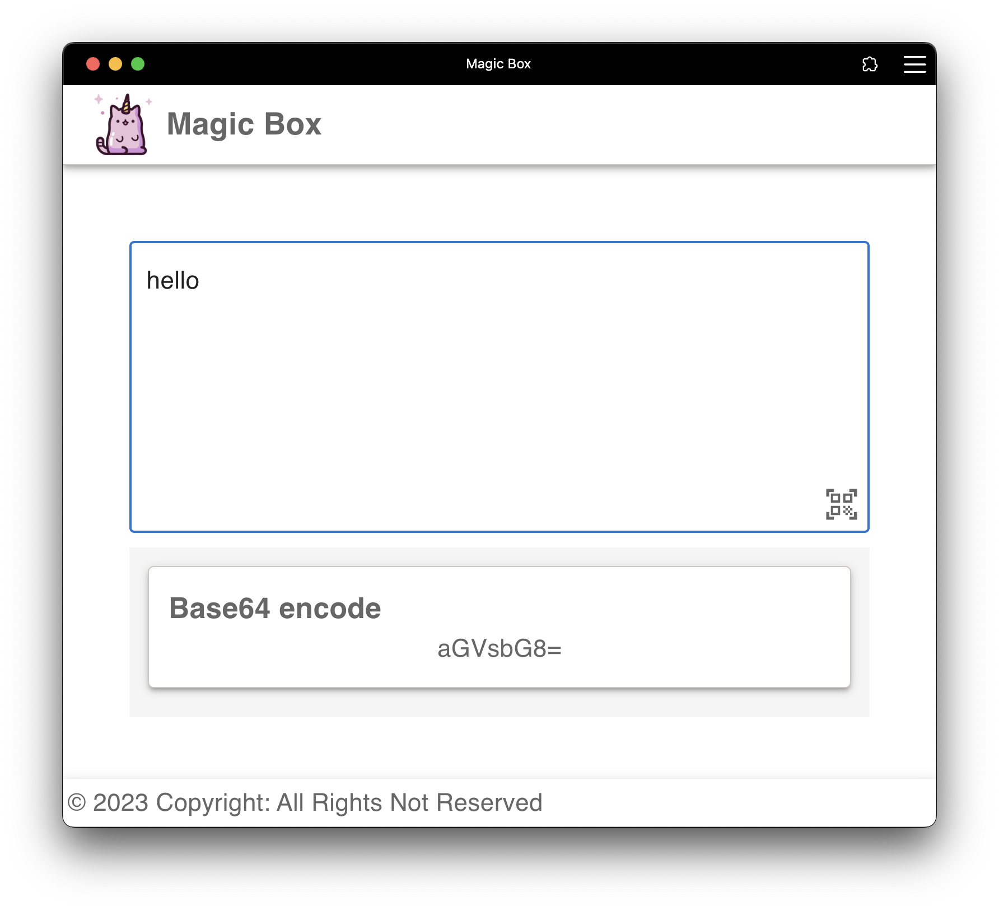 |
| can be decode to valid string | base64 decode | 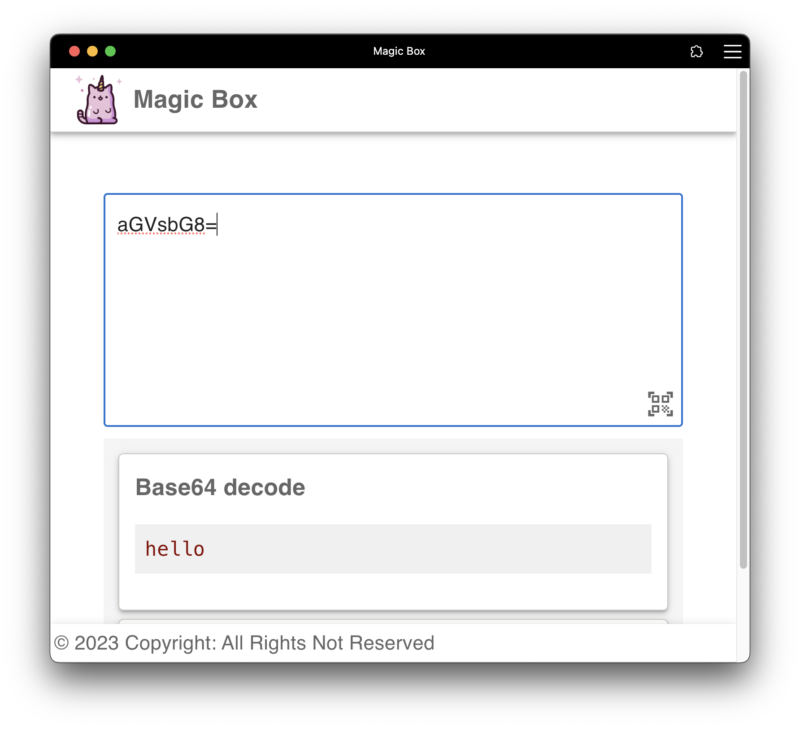 |

</details>

<details>
<summary> <b>CronExpressionBox</b> </summary>

| match rule            | description               | output                    |
| --------------------- | ------------------------- | ------------------------- |
| valid cron expression | convert to human language | 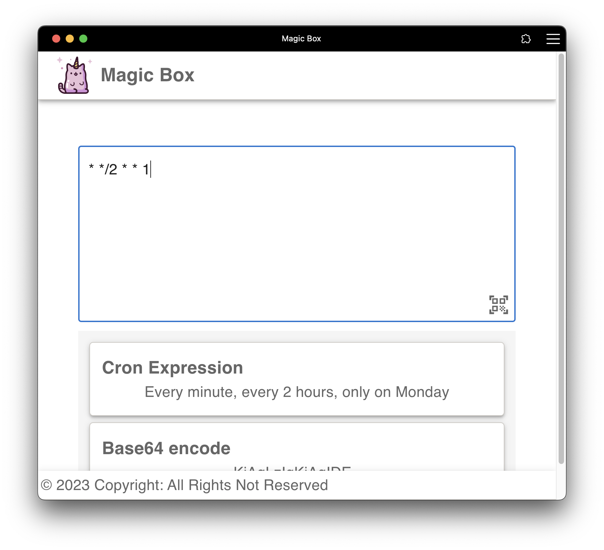 |

| options                          | description                             | example     |
| -------------------------------- | --------------------------------------- | ----------- |
| `l`, `lang`, `locate`            | select while human language             | ::locale=tw |
| ~~`tz`, `timezone`, `tzOffset`~~ | (deprecated) shift to the base timezone | ::tz=8      |

</details>

<details>
<summary> <b>DataConverter</b> </summary>

| match rule                | description                              | output                      |
| ------------------------- | ---------------------------------------- | --------------------------- |
| valid JSON/YAML/TOML/XML  | formatted output for the detected format | 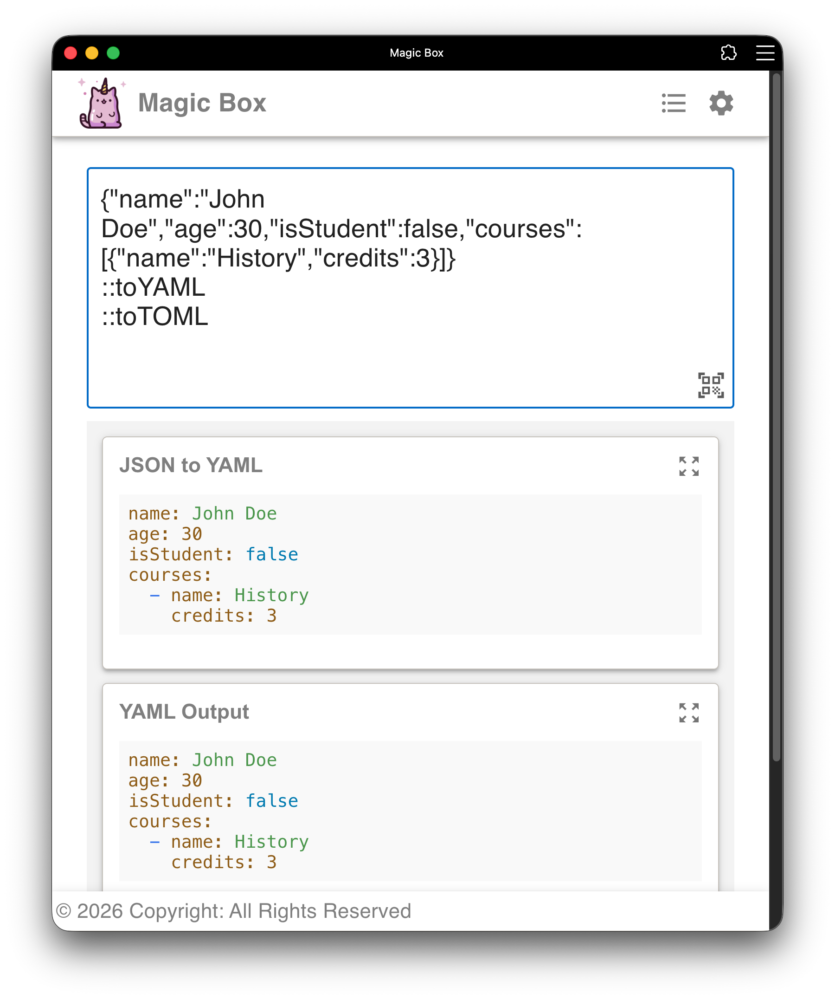 |
| option `json` or `tojson` | convert input to formatted JSON          | formatted JSON              |
| option `yaml` or `toyaml` | convert input to formatted YAML          | formatted YAML              |
| option `toml` or `totoml` | convert input to formatted TOML          | formatted TOML              |
| option `xml` or `toxml`   | convert input to formatted XML           | formatted XML               |

</details>

<details>
<summary> <b>DateCalculateBox</b> </summary>

| match rule          | description                              | example               | output                      |
| ------------------- | ---------------------------------------- | --------------------- | --------------------------- |
| `date1` + `number`d | add days to a date                       | `now + 7d`            | 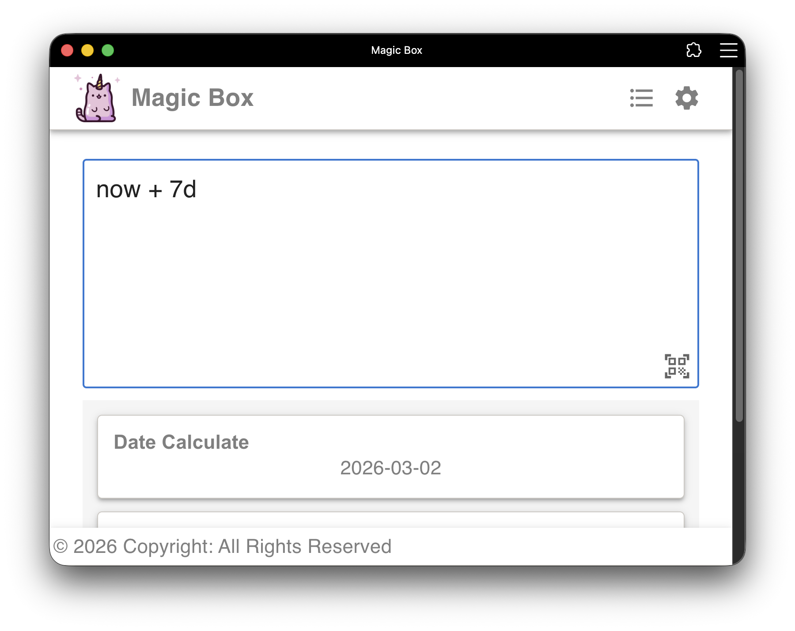 |
| `date1` - `number`d | subtract days from a date                | `2025-01-01 - 30d`    |                             |
| `date1` to `date2`  | calculate the duration between two dates | `today to 2025-12-31` |                             |

</details>

<details>
<summary> <b>GenerateQRCodeBox</b> </summary>

| match rule                       | description      | output                       |
| -------------------------------- | ---------------- | ---------------------------- |
| contains option `qr` or `qrcode` | generate QR Code | 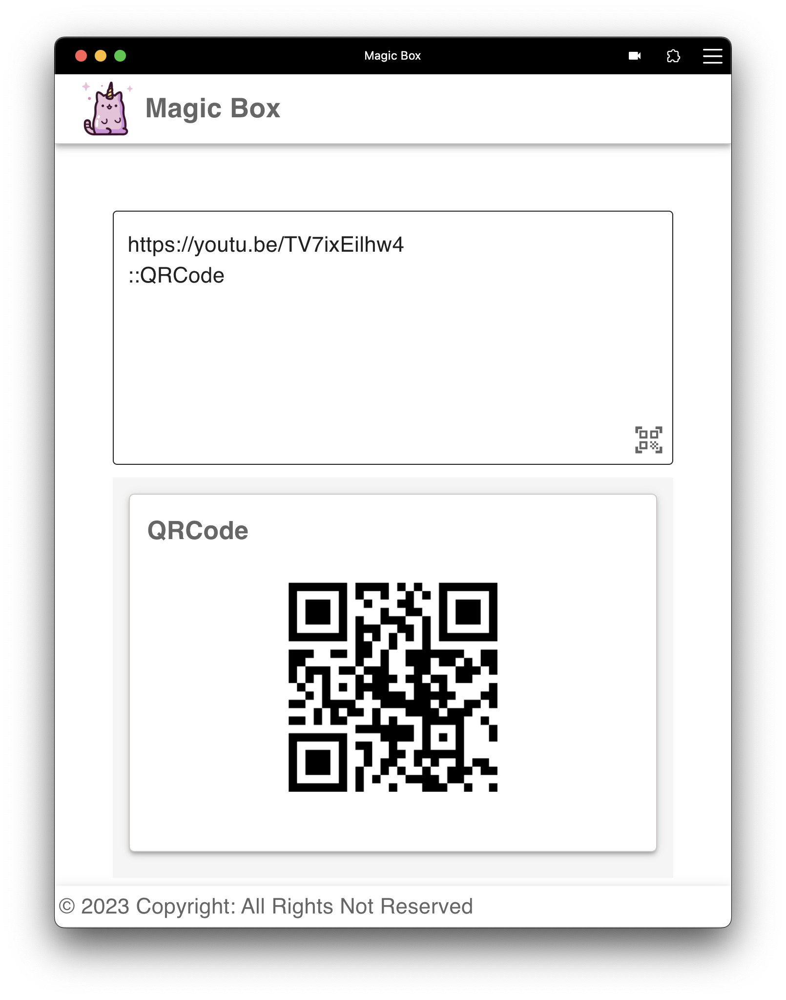 |

| options        | description | example    |
| -------------- | ----------- | ---------- |
| `qr`, `qrcode` | --          | `::QRCode` |

</details>

<details>
<summary> <b>HashBox</b> </summary>

| match rule                               | description                           | output           |
| ---------------------------------------- | ------------------------------------- | ---------------- |
| contains option `hash`, `sha1`, `sha256`, or `sha512` | compute cryptographic hash of the input | lowercase hex digest |

| options  | description                              | example      |
| -------- | ---------------------------------------- | ------------ |
| `hash`   | compute SHA-1, SHA-256, and SHA-512      | `::hash`     |
| `sha1`   | compute SHA-1 digest                     | `::sha1`     |
| `sha256` | compute SHA-256 digest                   | `::sha256`   |
| `sha512` | compute SHA-512 digest                   | `::sha512`   |

MD5 is intentionally omitted — it is not available in Web Crypto, and adding an npm dependency for a broken algorithm is not worthwhile.

</details>

<details>
<summary> <b>JWTBox</b> </summary>

| match rule       | description                | output                  |
| ---------------- | -------------------------- | ----------------------- |
| valid JWT string | decode JWT header and body | 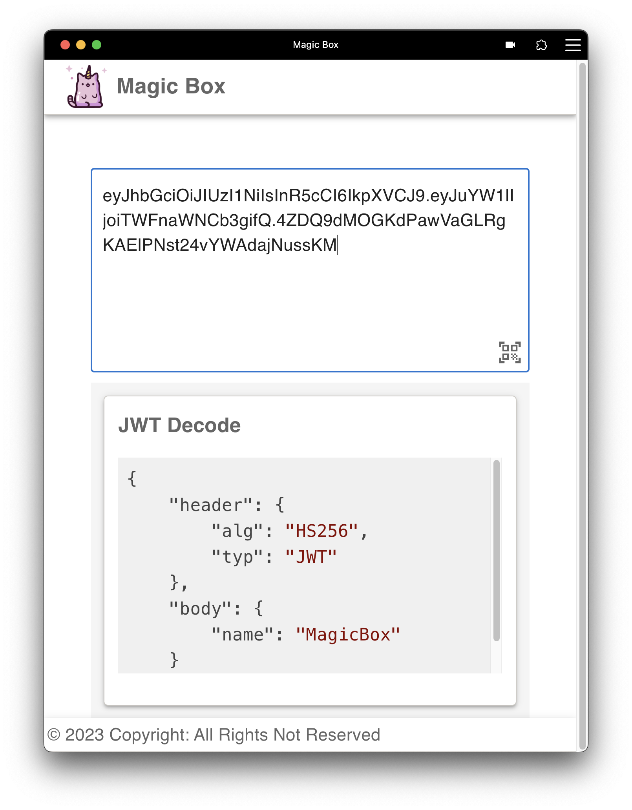 |

</details>

<details>
<summary> <b>K8sSecretBox</b> </summary>

| match rule                 | description                               | output                  |
| -------------------------- | ----------------------------------------- | ----------------------- |
| valid K8s Secret YAML/JSON | decode base64 values in a K8s Secret data | 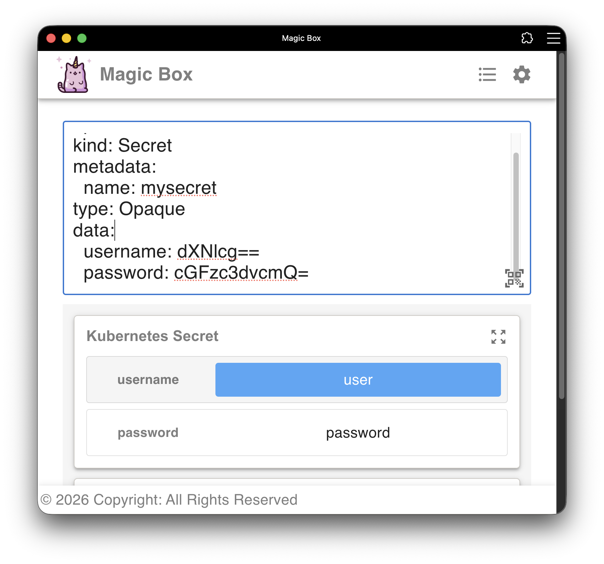 |

</details>

<details>
<summary> <b>MathExpressionBox</b> </summary>

Powered by the in-tree [`math-box`](wasmModules/math-box/) WASM module —
a clean-room expression evaluator written in Rust, replacing `mathjs` since
v0.2 to keep the bundle small and the licence pure MIT/Apache-2.0.

| match rule         | description               | output                       |
| ------------------ | ------------------------- | ---------------------------- |
| valid math express | calculate the math result | 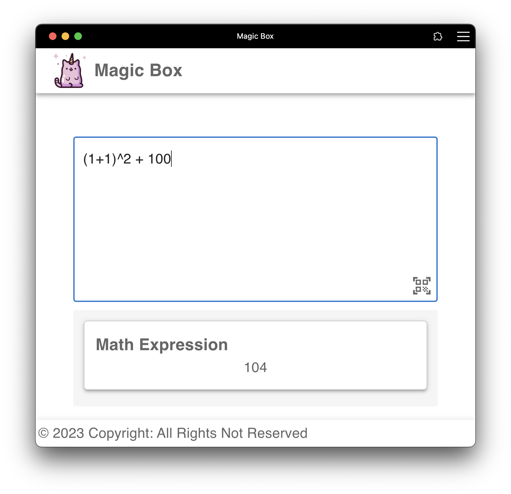 |

Supported syntax (highlights):

- arithmetic `+ - * / % ^`, factorial `5!`, function calls `sin(PI/2)`
- variables and statement chaining: `x = 5; y = 7; x*y + x^2`
- user-defined functions: `sq(x) = x^2; sq(11) + sq(13)`
- BigInt literals via `n` suffix: `9007199254740993n + 1n`
- fractions: `frac(1, 3) + frac(1, 4)` → `7/12`
- complex numbers: `(2 + 3*i) * (2 - 3*i)` → `13`
- units: `1 km + 500 m to m` → `1500 m` (length / mass / time SI)

See [wasmModules/math-box/NOTES.md](wasmModules/math-box/NOTES.md) for the
full design and roadmap, and
[BENCHMARK.md](wasmModules/math-box/BENCHMARK.md) for performance vs `mathjs`.

</details>

<details>
<summary> <b>MyIPBox</b> </summary>

| match rule     | description                                | output             |
| -------------- | ------------------------------------------ | ------------------ |
| `ip` or `myip` | fetch and show your public IP and location | 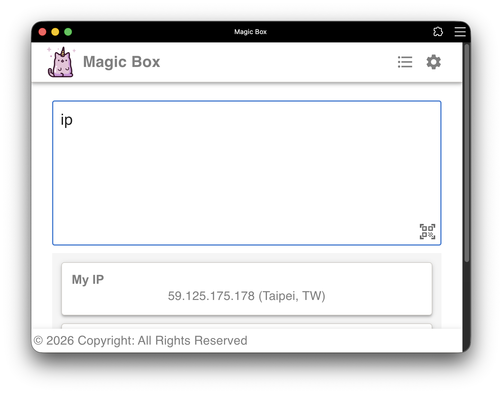 |

</details>

<details>
<summary> <b>NowBox</b> </summary>

| match rule          | description                                                                                    | output            |
| ------------------- | ---------------------------------------------------------------------------------------------- | ----------------- |
| input matches `now` | show current time in 3 difference formats: `RFC 3339`, `RFC 3339 (UTC+8)`, and `Timestamp (s)` | 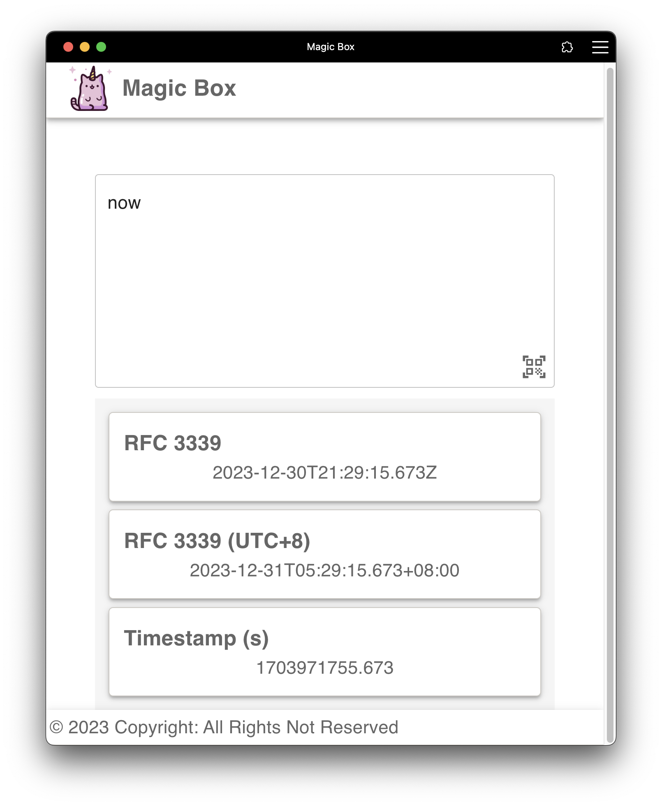 |

</details>

<details>
<summary> <b>PasswordBox</b> </summary>

| match rule                                    | description                                        | output |
| --------------------------------------------- | -------------------------------------------------- | ------ |
| contains option `password`, `pwd`, or `pass`  | generate 3 secure random password candidates       |        |

| options                    | description                                      | example           |
| -------------------------- | ------------------------------------------------ | ----------------- |
| `password`, `pwd`, `pass`  | trigger; optionally set length (`::password=24`) | `::password=24`   |
| `len`                      | password length (default: 16, range: 4–256)      | `::len=32`        |
| `nosymbols`                | exclude symbol characters                        | `::nosymbols`     |
| `nonumbers`                | exclude numeric characters                       | `::nonumbers`     |
| `nolower`                  | exclude lowercase letters                        | `::nolower`       |
| `noupper`                  | exclude uppercase letters                        | `::noupper`       |

</details>

<details>
<summary> <b>ShortenURLBox</b> </summary>

| match rule                          | description            | output                   |
| ----------------------------------- | ---------------------- | ------------------------ |
| contains option `surl` or `shorten` | generate a shorten URL | 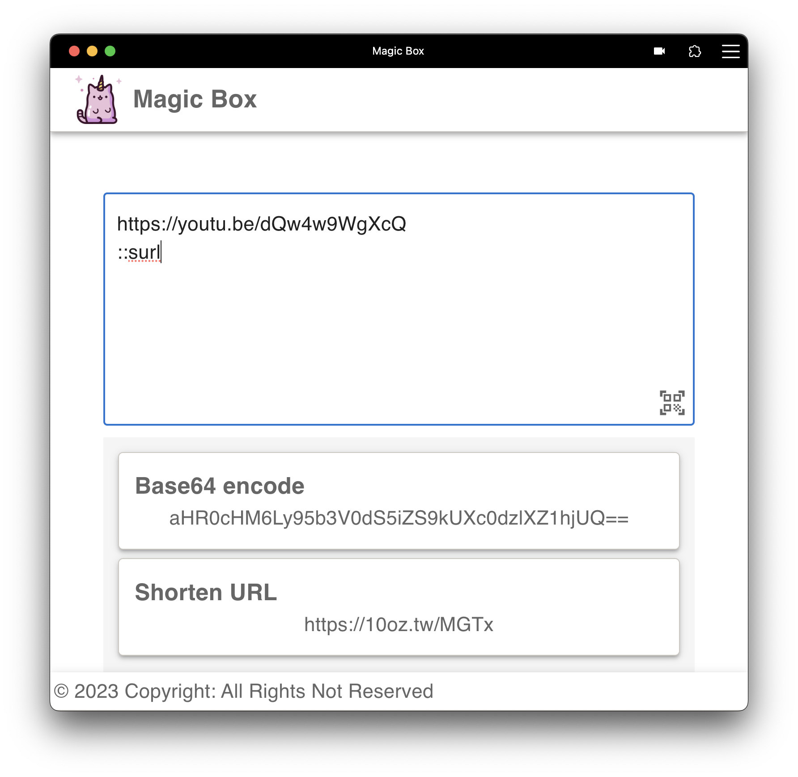 |

| options           | description                                                        | example      |
| ----------------- | ------------------------------------------------------------------ | ------------ |
| `surl`, `shorten` | desired short URL result, if not set, a random string will be used | `::surl=foo` |

</details>

<details>
<summary> <b>TimeFormat</b> </summary>

| match rule                 | description                         | output                   |
| -------------------------- | ----------------------------------- | ------------------------ |
| valid RFC 3339 time string | timestamp in second and millisecond | 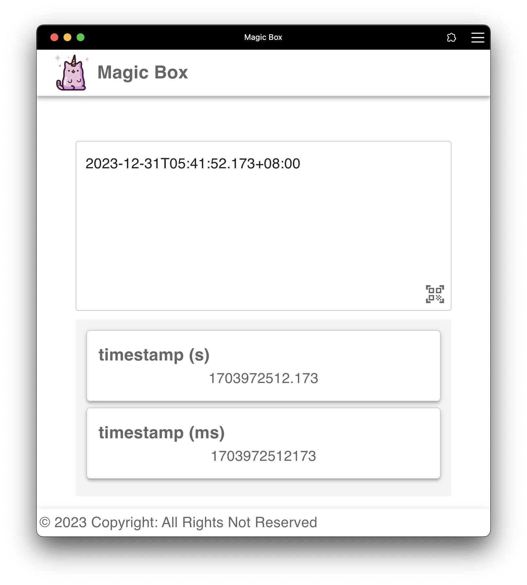 |

</details>

<details>
<summary> <b>TimestampBox</b> </summary>

| match rule                                                                               | description                                | output                  |
| ---------------------------------------------------------------------------------------- | ------------------------------------------ | ----------------------- |
| valid timestamp. to avoid match all of number string, it only receive 1600 AD to 2500 AD | the time of timestamp in `RFC 3339` format | 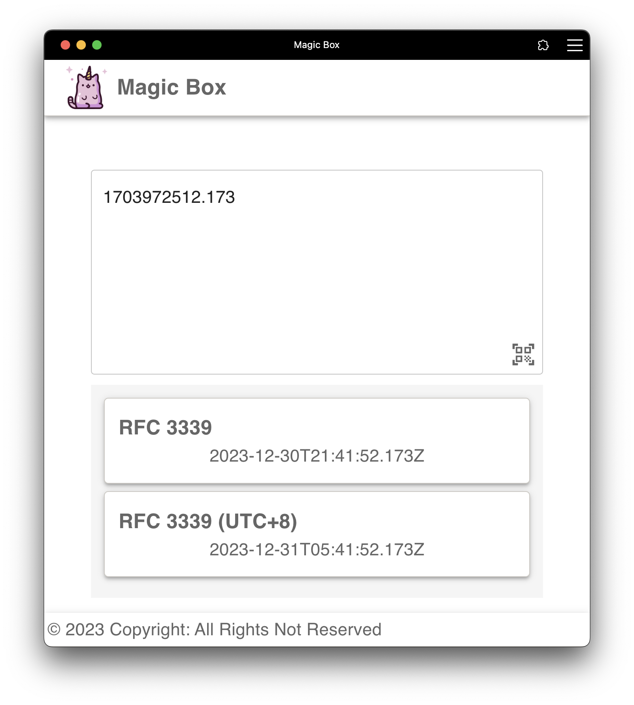 |

</details>

<details>
<summary> <b>URLDecode</b> </summary>

| match rule         | description                | output                          |
| ------------------ | -------------------------- | ------------------------------- |
| URL-encoded string | decoded URL-encoded string | 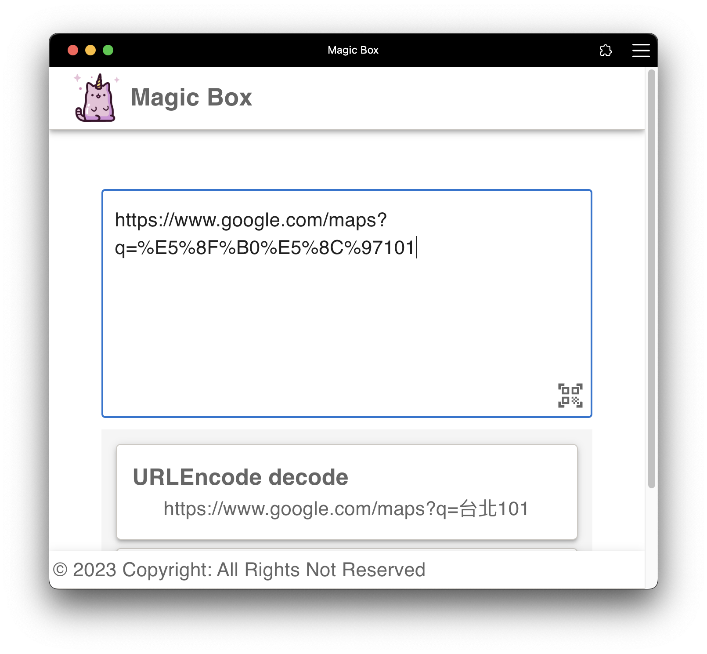 |

</details>

<details>
<summary> <b>RandomIntegerBox</b> </summary>

| match rule           | description                                  | example       | output               |
| -------------------- | -------------------------------------------- | ------------- | -------------------- |
| `random`             | generate a random number between 0 and 100   | `random`      | 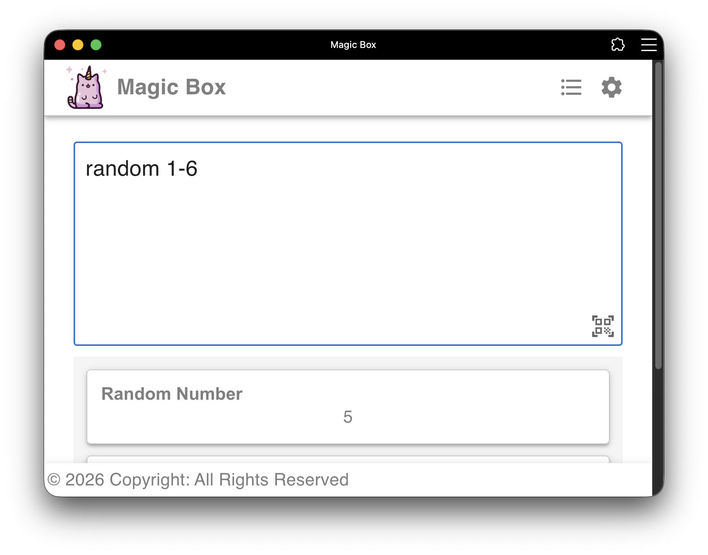 |
| `random` `max`       | generate a random number between 0 and max   | `random 1000` |                      |
| `random` `min`-`max` | generate a random number between min and max | `random 1-6`  |                      |

</details>

<details>
<summary> <b>ReadableBytesBox</b> </summary>

| match rule | description                                                          | example                  | output                      |
| ---------- | -------------------------------------------------------------------- | ------------------------ | --------------------------- |
| byte array | convert a byte array (comma or space separated) to a readable string | `72, 101, 108, 108, 111` | 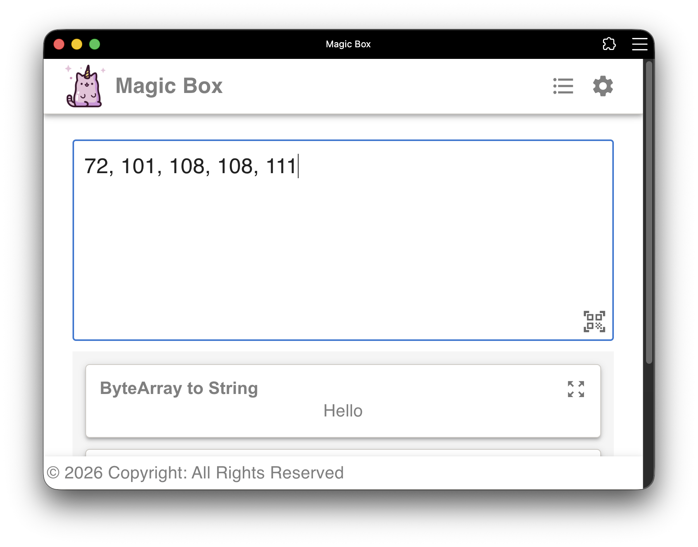 |

</details>

<details>
<summary> <b>UuidBox</b> </summary>

| match rule | description                     | output             |
| ---------- | ------------------------------- | ------------------ |
| `uuid`     | generate a new random UUID (v4) | 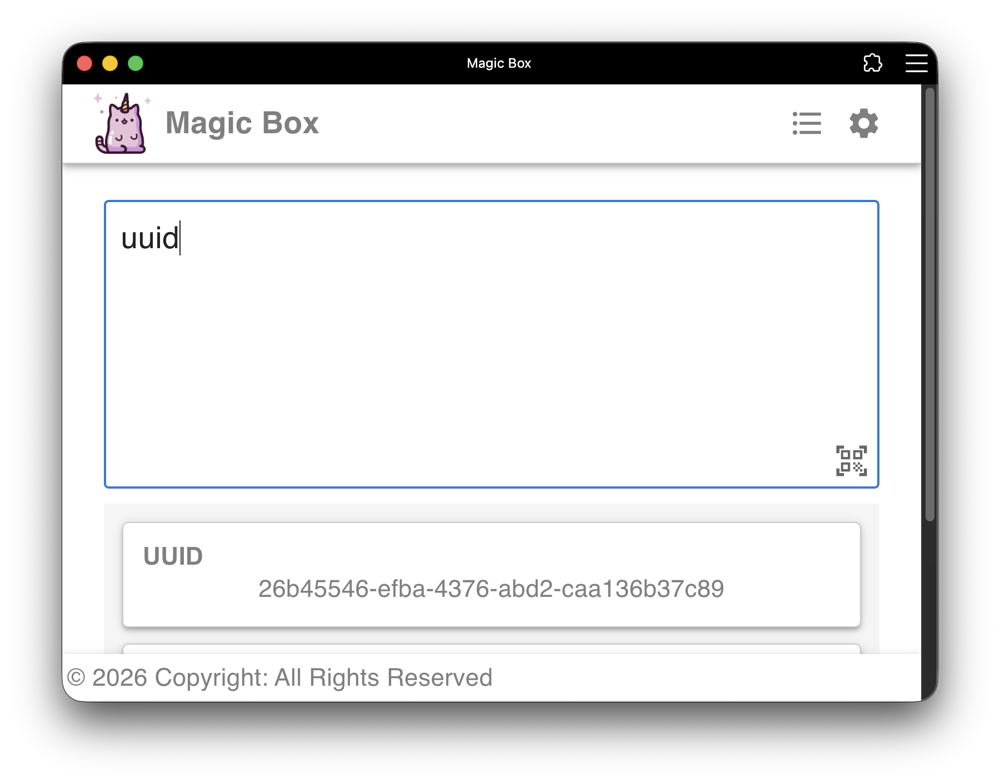 |

| options              | description              | example   |
| -------------------- | ------------------------ | --------- |
| `upper`, `uppercase` | return UUID in uppercase | `::upper` |

</details>

<details>
<summary> <b>WordCountBox</b> </summary>

| match rule | description                        | output                  |
| ---------- | ---------------------------------- | ----------------------- |
| any string | count lines, words, and characters | 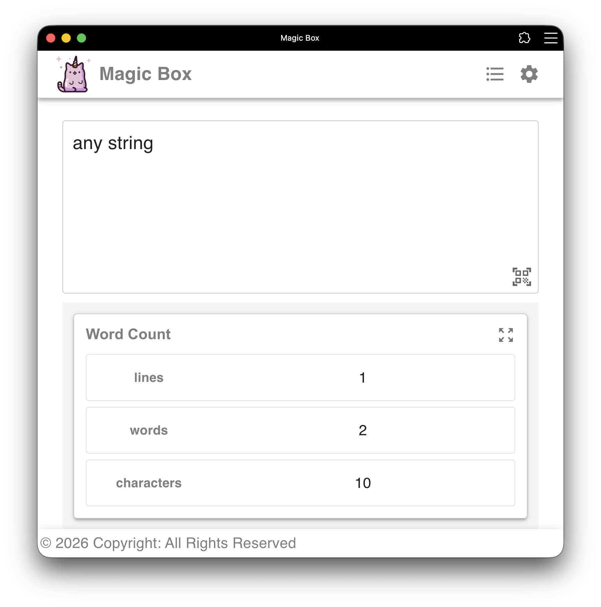 |

</details>

<details>
<summary> <b>CaseConverterBox</b> </summary>

| match rule | description                                                                                          | example                       |
| ---------- | --------------------------------------------------------------------------------------------------- | ----------------------------- |
| `::case`   | convert text to camelCase, PascalCase, snake_case, kebab-case, CONSTANT_CASE, dot.case, Title/Sentence | `hello world foo bar ::case` |

</details>

<details>
<summary> <b>HtmlEntityBox</b> </summary>

| match rule       | description                                  | example                                  |
| ---------------- | -------------------------------------------- | ---------------------------------------- |
| `::htmlencode`   | encode text to HTML entities                 | `<div>Tom & Jerry</div> ::htmlencode`    |
| `::htmldecode`   | decode HTML entities (named + numeric)       | `&lt;b&gt;hi&lt;/b&gt; ::htmldecode`     |
| `::htmlentity`   | show both encode and decode                  | `<a> ::htmlentity`                       |

</details>

<details>
<summary> <b>NumberBaseBox</b> </summary>

| match rule | description                                            | example          |
| ---------- | ----------------------------------------------------- | ---------------- |
| `::base`   | show integer in decimal, hex, octal, binary (BigInt)  | `255 ::base`, `0xff ::base` |

</details>

<details>
<summary> <b>LoremIpsumBox</b> </summary>

| match rule    | description                          | example         |
| ------------- | ------------------------------------ | --------------- |
| `::lorem`     | generate N paragraphs (default 3)    | `::lorem=2`     |
| `::words`     | generate N words                     | `::words=5`     |

</details>

<details>
<summary> <b>SlugifyBox</b> </summary>

| match rule | description                                            | example                       |
| ---------- | ----------------------------------------------------- | ----------------------------- |
| `::slug`   | lowercase hyphenated URL slug, diacritics removed     | `Héllo World! Foo_Bar ::slug` |

</details>

<details>
<summary> <b>RomanNumeralBox</b> </summary>

| match rule | description                                       | example         |
| ---------- | ------------------------------------------------- | --------------- |
| `::roman`  | integer (1-3999) ⇄ Roman numeral, auto-direction  | `2024 ::roman`, `MMXXIV ::roman` |

</details>

<details>
<summary> <b>ChmodBox</b> </summary>

| match rule | description                                          | example                  |
| ---------- | --------------------------------------------------- | ------------------------ |
| `::chmod`  | Unix permissions octal ⇄ symbolic (incl. special bits) | `755 ::chmod`, `rwxr-xr-x ::chmod` |

</details>

<details>
<summary> <b>MorseCodeBox</b> </summary>

| match rule       | description                  | example                    |
| ---------------- | ---------------------------- | -------------------------- |
| `::morse`        | encode text to Morse code    | `SOS ::morse`              |
| `::morsedecode`  | decode Morse code to text    | `... --- ... ::morsedecode` |

</details>

## Development ⛑️

It is recommended to use Node.js version 22.x

```bash
pnpm build:wasm
pnpm install
pnpm start
```

### Development Commands

- `pnpm build:wasm` - Build WASM modules before development/deployment (required for base64-box dependency)
- `pnpm start` - Start development server on port 3000
- `pnpm build` - Build for production (runs TypeScript compiler + Vite build)
- `pnpm test` - Run unit tests with Vitest
- `pnpm test:ui` - Run tests with Vitest UI
- `pnpm lint` - Run Biome check
- `pnpm lint:fix` - Run Biome check with auto-fix
- `pnpm test:e2e` - Run Cypress E2E tests
- `pnpm cypress` - Open Cypress test runner

### Testing

- Unit tests use Vitest with jsdom environment
- E2E tests use Cypress with custom commands in `cypress/support/`

### Prepare Deploy

Initial Deployment Preparation

```bash
npm install -g firebase-tools

firebase login
firebase init
```

```bash
firebase deploy
```

## Terminal UI (TUI) 🖥️

Magic Box ships an experimental terminal UI built with [ink](https://github.com/vadimdemedes/ink) (React for the terminal). It runs a subset of boxes headlessly in Node — no browser, no WASM, no network.

### Usage

```bash
# pass input as a CLI argument
bun run tui "uuid"

# pipe input via stdin
echo "1700000000" | bun run tui

# inline ::option directives work too (newline-separated)
printf 'uuid\n::uppercase' | bun run tui

# no argument and a TTY → interactive prompt (type and press Enter)
bun run tui
```

A `magic-box-tui` bin is also exposed via `package.json`'s `bin` field.

### How it works

The box-generation core (`src/modules/Box.ts`, `BoxBuilder`, `BoxSource`) is framework-agnostic: it no longer imports any React/MUI template. Each box carries `name` / `plaintextOutput` / `tag` / `kind` / `options` and leaves `boxTemplate` undefined; the web layer (`BoxCard` / `BoxModal`) falls back to `DefaultBoxTemplate`, while the TUI simply renders `plaintextOutput`. This lets the headless sources import cleanly under Node with zero MUI in the module graph (`src/tui/`).

### Foundation limitations

This is a foundation, not full parity. The TUI runs only node-safe sources (`src/tui/sources.ts`):

| Enabled | Excluded | Reason for exclusion |
| --- | --- | --- |
| Escape String, Cron, Date Calculate, Now, Random Integer, Readable Bytes, Time Format, Timestamp, URL Decode, UUID | Base64 (encode/decode) | depends on the `base64-box` WASM module |
| | Math Expression | depends on the `math-box` WASM module |
| | Data Converter, JWT | render via `CodeBoxTemplate` (React/MUI) |
| | Generate QR Code | renders via `QRCodeBoxTemplate` (React/MUI, browser canvas) |
| | K8s Secret, Word Count | render via `KeyValueBoxTemplate` (React/MUI) |
| | My IP, Shorten URL | perform network `fetch` |

Excluded sources can be added later by giving them plaintext-only headless paths (e.g. WASM bindings loaded from disk, or rendering their `plaintextOutput` without the React template).

## License 📃

Magic Box is licensed under MIT and Apache 2.0 dual-licensed.

You may obtain a copy of the License at [LICENSE-MIT](LICENSE-MIT) and [LICENSE-APACHE](LICENSE-APACHE)
